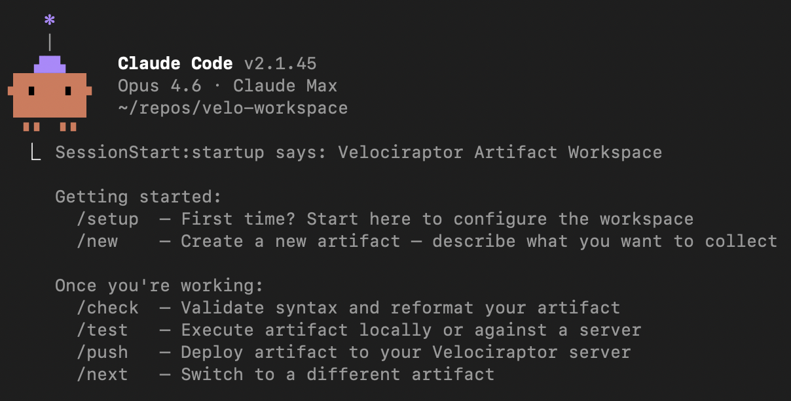

# Velociraptor Artifact Workspace

A [Claude Code](https://docs.anthropic.com/en/docs/claude-code) workspace for DFIR analysts to author, validate, test, and deploy custom [Velociraptor](https://docs.velociraptor.app/) artifacts. Describe what you want to collect — Claude handles the VQL.



## Quick Start

```
git clone https://github.com/liteman/velo-workspace.git && cd velo-workspace
claude
/setup
```

`/setup` bootstraps everything: downloads the Velociraptor binary, creates a Python virtualenv for the API client, generates server and API configs, and runs a health check.

Once the workspace is ready:

```
/new        # describe what you want to collect
/check      # validate and reformat the artifact
/test       # execute locally or against a server
/push       # deploy to your Velociraptor server
```

## How It Works

The workspace pairs Claude Code's agentic capabilities with Velociraptor's artifact system. You work in natural language — Claude translates your intent into well-structured VQL artifacts, validates them, and manages the full lifecycle from authoring through deployment.

**Keyword recognition** means Claude automatically loads the right context when you mention platform-specific terms (`EventLog`, `plist`, `ebpf`, `registry`), ask VQL questions, or paste queries for analysis. No special syntax needed.

**Slash commands** handle anything that touches the filesystem or shells out. This bright line keeps the interaction predictable: keywords inform, commands act.

## Commands

| Command  | What it does |
|----------|--------------|
| `/setup` | Bootstrap workspace — binary, venv, configs, health check |
| `/new`   | Scaffold a new artifact from templates |
| `/check` | Validate YAML syntax and reformat |
| `/test`  | Execute artifact (local CLI, local server, or remote fleet) |
| `/push`  | Deploy artifact to a Velociraptor server |
| `/next`  | Switch active artifact |

## Workspace Structure

```
custom/          Artifacts you author (by platform and category)
templates/       Starter templates for common patterns
scripts/         Setup, session-start, and helper scripts
config/          Server config, API config, preferences (gitignored)
bin/             Velociraptor binary (gitignored)
venv/            Python virtualenv for pyvelociraptor (gitignored)
.claude/
  commands/      Slash command implementations
  guides/        VQL reference (core + platform overlays)
```

Artifacts follow the naming convention `Custom.{Platform}.{Category}.{Name}` and live at `custom/{Platform}/{Category}/{Name}.yaml`.

## Templates

The workspace ships with templates covering common artifact patterns across platforms:

| Platform | Templates |
|----------|-----------|
| **Common** | Base client/server artifacts, parameterized artifacts, process detection, file search enrichment, multi-source detection, system commands |
| **Windows** | EventLog queries, registry queries, ETW monitoring, NTFS forensics, WMI queries, Sigma rules |
| **macOS** | Plist parsing, SQLite queries, binary format parsing |
| **Linux** | Syslog/journal, proc filesystem, SSH security, eBPF monitoring, network connections, package queries, config file parsing |
| **Server** | Client queries/collections, hunt management, event monitoring, alert webhooks, enrichment APIs, label automation, scheduled tasks |

Run `/new` and describe what you want — Claude picks the right template and customizes it.

## Testing Tiers

| Tier | Method | Best for |
|------|--------|----------|
| **Local CLI** | `velociraptor artifacts collect` | Quick syntax and logic checks when the artifact targets your OS |
| **Local server** | `velociraptor gui` + API | Full server flow — hunts, scheduling, result ingestion |
| **Remote server** | pyvelociraptor API | Production-like testing; required for cross-platform artifacts |

`/test` selects the appropriate tier based on the artifact's target platform and your available configuration.

## Requirements

- [Claude Code](https://docs.anthropic.com/en/docs/claude-code) CLI
- macOS, Linux, or Windows (for local testing, the artifact's target platform should match your OS)
- Internet access for initial setup (downloads the Velociraptor binary)

Everything else is handled by `/setup`.

## Contributing

See [CONTRIBUTING.md](CONTRIBUTING.md) for guidelines on submitting templates, example artifacts, VQL guides, and other improvements.

## Security

The workspace API client is configured with least-privilege permissions by default — enough to upload artifacts and run test hunts, but no shell execution (`execve`) on endpoints. See [SECURITY.md](SECURITY.md) for details on the permission model and how to upgrade when needed.

## License

[MIT](LICENSE)
